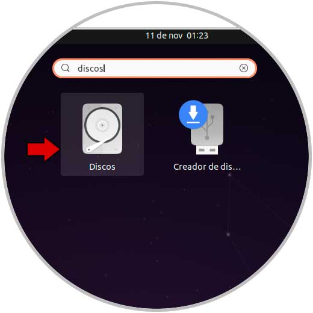
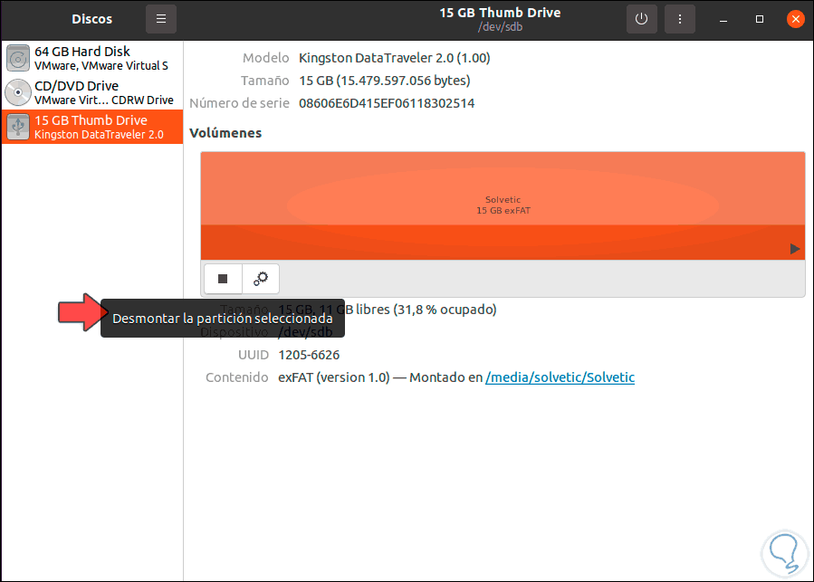
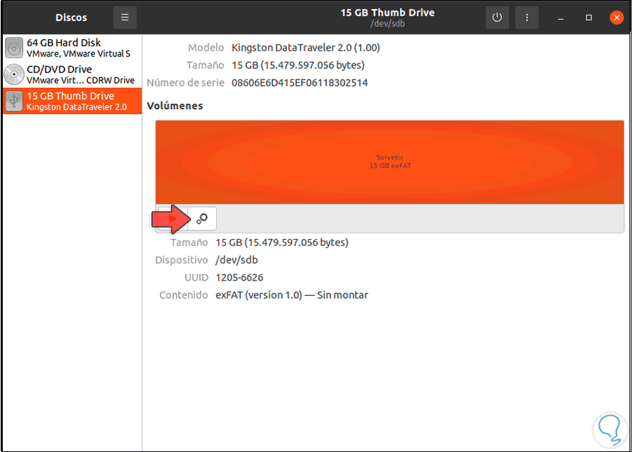
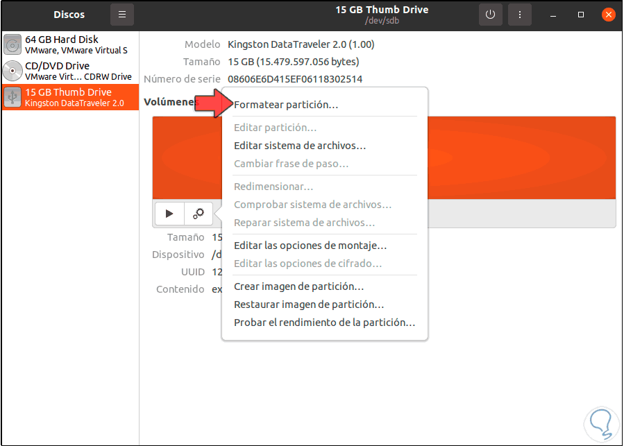
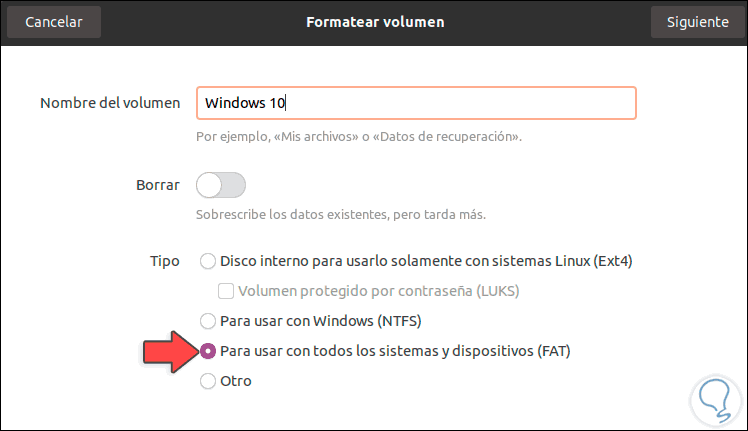
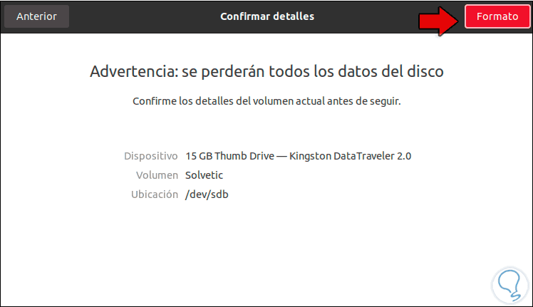
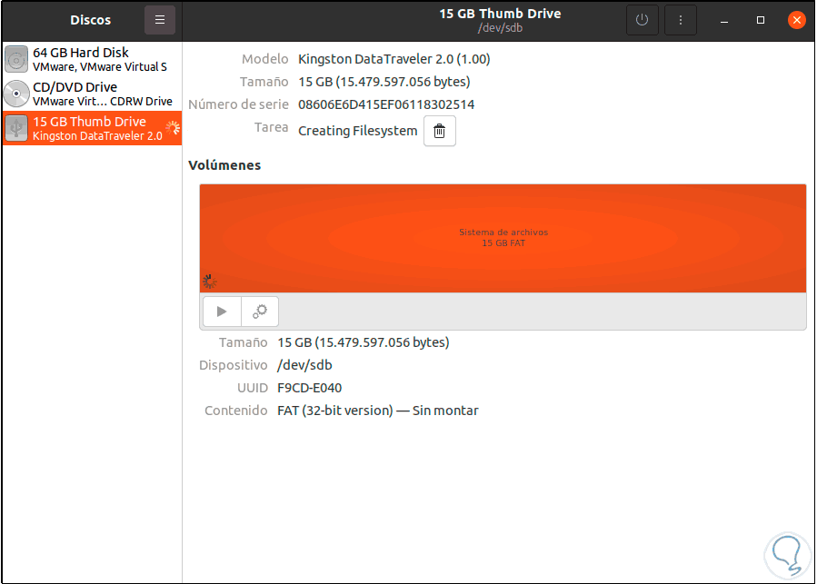
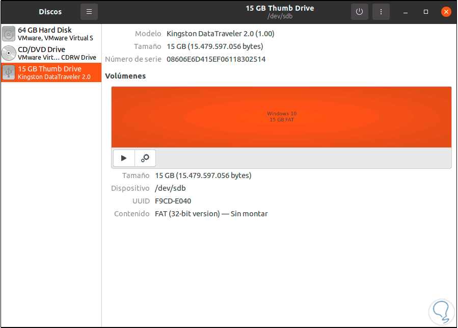
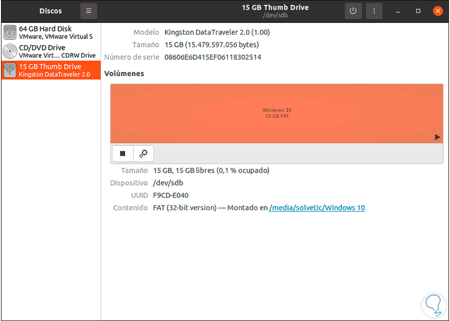

**Bash script to create bootable USB drive from an ISO image file.**

It works with any GNU/Linux distribution and Microsoft Windows. It is not compatible with MacOS.

## User manual

### USB drive preparation

1.  Download the iso image of the Windows or GNU Linux operating system.
2.  From Activities we open the Disks utility: 
        
3.  There we are going to unmount the USB drive from the system: 
        
4.  Once disassembled, we will see the following: 
        
5.  We click on the pinion icon and in the displayed list we select "Format partition": 
        
6.  We assign a name to the drive and select the FAT format: 
        
7.  We click Next and we will see this message: 
        
8.  We apply the changes by clicking on "Format": 
        
9.  Once the process is finished we will see the format applied correctly: 
        
10.  We mount the USB by clicking on the playback sign: 
        

